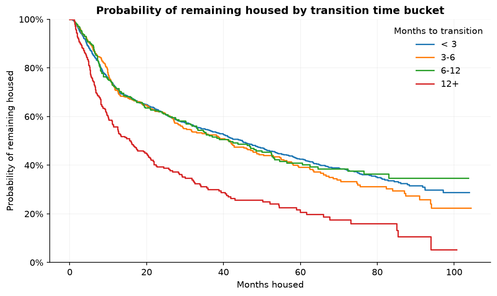

# Housing Retention Survival Analysis

A preliminary survival analysis I led at Mathematica that examined the association between a key predictor and time to an event, where most events had not yet occurred by the end of the study period.

**All data in this repository are synthetic.** The methodology, workflow, and conclusions are real; the numbers are simulated to reproduce the shape of the original findings. I stored synthetic data in [synthetic_data/](synthetic_data) so the pipeline can run end to end.

## Background

This analysis was conducted for a state-run housing program that places adults with serious mental illness into long-term housing. Since the program's goal was sustained housing, a member leaving the program shortly after placement, which I refer to as a **separation**, was considered a negative outcome.

Program leadership was concerned that approved members were waiting a long time to be placed in housing. I refer to the time between program approval and actual housing placement as **transition time**. Leadership was concerned that long waits could leave individuals in unstable circumstances with deteriorating mental health, potentially increasing their risk of separating from the program soon after finally being housed.

The program was considering committing resources to a three-month placement target. Before making that investment, leadership wanted evidence that shorter transition times were actually associated with better housing retention (i.e., fewer separations).

Using Kaplan-Meier survival analysis, I found no evidence that members who transitioned within three months had better retention than members whose transition times ranged from three months to one year. Members who waited twelve months or longer, however, showed significantly lower retention. I interpreted this latter finding cautiously given the limitations discussed in the [Limitations](#limitations) section.

## Data

### Data Description

The analysis uses **member-month** data, where each row represents a member and month they were enrolled in the program. The dataset contains 3,000 members across roughly 115,000 member-month records and covers January 2014 through the January 2025 data extract.

| Field | Description |
| --- | --- |
| ID | Unique member identifier. |
| LEASESTARTDATE | Start date of the member's lease (i.e., when they entered the program). This date is repeated across all member-month records. |
| EFFMNTHBEGIN | Effective beginning date for the member-month. This is the first day of the month unless the lease began during the month, in which case it is the lease start date. For example, a lease beginning on 8/5/2020 has an EFFMNTHBEGIN of 8/5/2020 rather than 8/1/2020.|
| EFFMNTHEND | Effective ending date for the member-month. This is the last day of the month unless the member separated from the program during that month, in which case it equals HOUSESEPDATE. For example, a member who separated on 10/15/2020 has an EFFMNTHEND of 10/15/2020. |
| APPROVALDATE | Date the member was approved for the program. |
| HOUSESEPDATE | Date the member separated from the program. This is populated in the member's separation month and represents the end of their observed time in the program. Blank if the member had not separated as of the data extract. |
| DEATHDATE | Member's date of death. Repeated across all member-month records if the member died and blank if the member was alive as of the data extract. |

### Initial Data Processing

#### 1. Define the Analysis Population

Only members whose first lease began after 2017 were included in the analysis. Earlier data were considered less reliable based on guidance from the client.

#### 2. Resolve Data-Quality Issues

I identified the following edge cases during data validation, discussed them with the client, and resolved them before analysis.

- Missing approval date
  - Issue: All members were expected to have an approval date, but a small number did not.
  - Client clarification: These members had been approved for the program using different software that did not track approval dates.
  - Resolution: These members were excluded from the analysis because transition time was the primary predictor. Fewer than 1% of members were affected, and no systematic pattern was identified in why these members had been approved through a different process.
- Death date before separation date
  - Issue: Some members had a death date that preceded their separation date.
  - Client clarification: The client explained that this was caused by a reporting lag between when a member died and when their separation date was populated.
  - Resolution: Death date was treated as the source of truth. When death date was populated, separation date was set to death date so that the separation date accurately reflected the member's date of death.

After applying the population filters and resolving the missing approval-date issue, 2,251 members remained in the analysis population (75% of the original 3,000 members).

#### 3. Collapse
After filtering to the study population and resolving the data-quality issues in the member-month data, I collapsed the data to one row per member. Then, using the information from each member's first month in the program, I derived the variables used in the survival analysis (described [Methods](#analytical-method)).

## Analytical Method

### Predictor

**Transition time** — the number of days between a member's approval date and their lease start date. 
Members were grouped into four buckets: under three months, three to six months,
six to twelve months, and twelve or more months. Cutpoints use a flat 30-day month, so the
boundaries are 90, 180, and 360 days.

### Outcome

**Time housed** — the number of days from a member's lease start date until separation, or, 
for members who had not separated, until the last day of the data extract.

### Handling censoring

Most members had not separated from housing as of the data extract, meaning the event had not yet occurred for them. 
This is right censoring. One member might have been
housed a single day when the data were pulled; another might have been housed three years
without separating. Treating both simply as non-separators ignores how long each was actually
observed, and can bias any comparison between groups whose members entered at different times.

Kaplan-Meier estimation accounts for this. Rather than simply calculating the proportion of members who separated, it estimates the probability of remaining in the program over time. At each point where a separation occurs, the method considers only members who are still being observed and have not yet separated. A censored member contributes information to the analysis for exactly as long as they were observed, then leaves the risk set without being treated as a separation.

#### Comparing groups

I estimated a Kaplan-Meier curve for each transition-time bucket, compared them visually, and
tested for differences using pairwise log-rank tests. 

## Findings



The Kaplan-Meier curve shows the estimated probability of remaining housed over months housed. A curve that sits below another indicates a lower estimated probability of remaining housed at a given point in time, while overlapping curves suggest similar retention rates.

Two findings stood out:

1. Members who transitioned in under three months had similar retention to those who transitioned in three to six months or six to twelve months. Their Kaplan-Meier curves largely overlapped, and none of the pairwise comparisons among these three groups approached statistical significance.
2. Members who took 12 or more months to transition appeared to have lower retention than members in the other three groups. Each pairwise comparison between the 12+ month group and the other transition-time groups was statistically significant.

My takeaway from this analysis was that there was not enough evidence to justify investing in an under-three-month transition initiative based on retention alone. While members with 12+ month transition times did appear to have lower retention, I believed the more useful next step was to understand why these transitions were taking so long in the first place. Identifying the factors driving lengthy transitions could also shed light on meaningful ways to improve retention.

## Limitations

**Association, not causation:** This was a preliminary analysis and does not establish that longer transition times cause lower retention. Transition times were not randomly assigned, so members who took longer to transition may differ systematically from those who were housed more quickly. Those same differences could also affect retention. Baseline clinical acuity is one plausible example: if members with more complex clinical needs both took longer to house and were more likely to leave the program, the observed relationship between transition time and retention could reflect underlying differences in clinical need rather than an effect of transition time itself. In that case, simply speeding up the transition would not necessarily improve retention. Incorporating member-level clinical risk scores and stratifying by acuity would help assess this possibility.

**The predictor was binned:** Treating transition time as four categories rather than a continuous variable discards information, and the cutpoints at 3, 6, and 12 months were chosen for operational relevance rather than anything in the data. A Cox proportional hazards model with transition time entered continuously, and clinical risk score included as a covariate, would be a natural next step.

## Project Structure

```
src/
├── run_time_to_transition.py   # Pipeline entry point: data -> population -> analytic file -> report
├── pop.py                      # Filter data to the study population IDs
├── create_analytic.py          # Clean data; filters to one row per member; derives survival variables
├── paths.py                    # Define project paths
├── query_sql.py                # Original database query; reference only
└── report.qmd                  # Descriptive statistics, KM estimation, log-rank tests

synthetic_data/
└── member_month.csv            # Synthetic member-month data used by the pipeline

output/                         # Created by the pipeline
├── analytic_file.pkl           # Member-level analytic file; input to report.qmd
├── report.html                 # Rendered report, created from report.qmd
└── km_curve.png                # Kaplan-Meier curve embedded in this README

requirements.txt                # Python dependencies
```

`output/` is rebuilt on every run and is not tracked in git, with one exception: `km_curve.png` is committed so GitHub can display the figure embedded in this README.

The original analysis read the member-month data from a database that is no longer accessible. For this repository, I replaced that connection with the synthetic CSV in `synthetic_data/`. The original SQL is preserved in `query_sql.py` for reference but is not executed by the pipeline.

## Running the Analysis

Requires Python 3.11+ and [Quarto](https://quarto.org) 1.4 or later.

```bash
python -m venv .venv && source .venv/bin/activate
pip install -r requirements.txt
python src/run_time_to_transition.py
```

The pipeline will:

1. Read the synthetic member-month data.
2. Filter to the study population.
3. Filter member-month records to one row per member and derive the survival variables.
4. Save the analytic file to `output/`, which is the input of `report.qmd`.
5. Render `report.qmd` to `output/`.

Steps 1 through 4 run in Python. Step 5 requires Quarto.